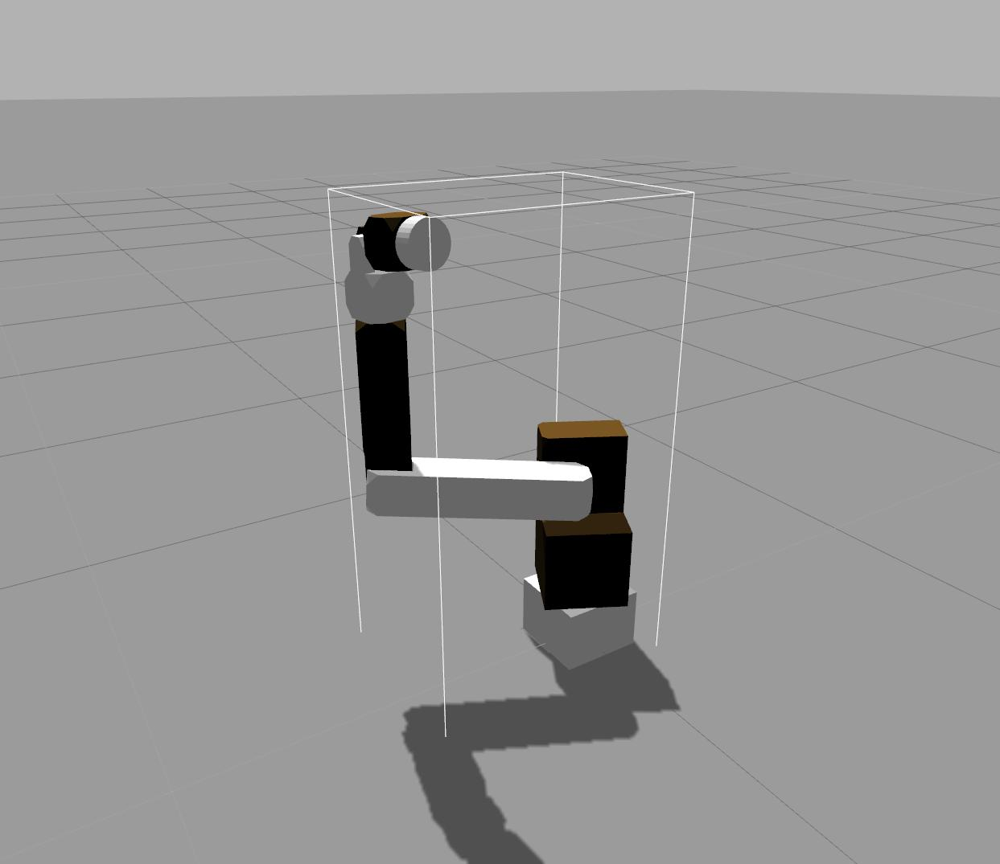

# gz_factory

## Maintainer
- [SJ Kim](http://bus710.net)<<bus710@gmail.com>>

## Table of contents
- [Description](#description)
- [Install](#install)
- [Models](#models) 

## Description
A virtual factory in Gazebo Robot Simulator.
Users can see the basic structure of a Gazebo project, and drive a virtual manipulator by using Python script.

## Install
1. Install ROS indigo on Ubuntu 14.04.
2. Setup ROS enviroment.
3. Clone this repository.
```
cd $HOME/catkin_ws/src/
git clone https://github.com/bus710/gz_factory
cd $HOME/catkin_ws
catkin_make
source devel/setup.bash
roslaunch gz_factory gz_factory.launch
```
4. If you see Gazebo launches well, open a new terminal.
5. Run a Python script.
```
cd $HOME/catkin_ws/src/gz_factory/src
python pub_for_gz_mani.py
```

## Models
### gz_mani
A custom 6 DoF manipulator

